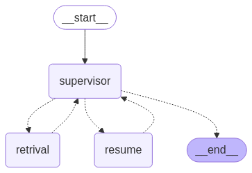

# AI Job Agent - Multi-Agent System

This project implements an AI Job Agent using a multi-agent approach. It leverages LangChain and LangGraph to create a system that can understand user job search requests, retrieve relevant job using RAg pipeline or web search and resume information, and provide career advice.

## Architecture

The system follows a multi-agent architecture as depicted in the image:


* **Supervisor Agent (Supervisor):** This agent acts as the orchestrator. It interprets user requests, autonomously asks for further information if needed, breaks down the request into tasks, and directs the flow between the Retrieval Agent and Resume Agent.
* **Retrieval Agent:** This agent retrieves job listings and resume information using LLMs and a Retrieval Augmented Generation (RAG) pipeline or web search if no relevant information is found. It utilizes semantic search for improved accuracy and formats the retrieved information and better job matching.
* **Resume Agent:** This agent provides career advice on tailoring resumes and can update resumes based on job market trends foud by the Retrival agent.

## Technology Stack

* **LangChain Core:** Core abstractions for building LLM-powered applications.
* **LangGraph:** Framework for building stateful, multi-actor applications with LLMs.
* **LangChain Community:** Integrations with various third-party services and tools.
* **LangChain Groq:** Integration with the Groq platform for accelerated inference.
* **LangChain Experimental:** Experimental features and modules.
* **Weaviate Client:** Vector database for semantic search and RAG.
* **Torch:** Deep learning framework for model training and inference.
* **Sentence Transformers:** Library for generating sentence embeddings.
* **Python Jobspy:** Library for scraping job listings from various sources.
* **Flask:** Web framework for creating the API.
* **Pandas:** Data analysis and manipulation library.

## Getting Started

1.  **Clone the repository:**

    ```bash
    git clone <repository_url>
    cd job-agent
    ```

2.  **Install dependencies:**

    ```bash
    pip install -r requirements.txt
    ```

3.  **Set up environment variables:**

    * `WEAVIATE_URL`: URL of your Weaviate instance.
    * `WEAVIATE_API_KEY`: API key for your Weaviate instance (if applicable).
    * `GROQ_API_KEY`: API key for Groq platform (if using Groq).
    * Other necessary API keys or configurations.

4.  **Run the application:**

    ```bash
    python main.py
    ```

    The application will start a Flask server, and you can interact with the AI Job Agent through the API endpoints.

## Entry Point

The main entry point for the application is `main.py`. This file initializes the agents, sets up the LangGraph workflow, and starts the Flask server.

## Usage

Provide examples of how to interact with the API or use the application. Include sample requests and expected responses.

## Future Enhancements

* Implement user authentication and authorization.
* Add support for more job boards and resume formats.
* Improve the accuracy and efficiency of the RAG pipeline.
* Add more features to the Resume Agent, such as cover letter generation and interview preparation.
* Deploy the application to a cloud platform for scalability and availability.

## Contributing

Contributions are welcome! Please submit a pull request or open an issue for any bugs or feature requests.

## License

This project is licensed under the MIT License - see the [LICENSE](LICENSE) file for details.

## Contact

Seif Khelifi
khelifiseif1@gmail.com